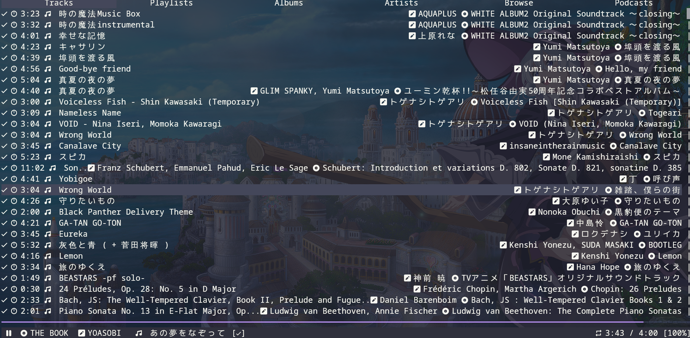

## A `ncspot` Clone

This repo is a clone of [`ncspot`](https://github.com/hrkfdn/ncspot), aiming at adding some more __useful commands__, __refining the UI__, and __clean up some dirty code__ I believe.

## Features

- All `ncspot` features
- Some features which is more intuitive to me, like current one `playorplaynext`

## More Works to Do

- [ ] More flexible keymap settings, supporting something like this:

```toml
# a single keybinding with different functions in different views
"Enter" = { queue = "play", playlist = "playnext" }
```

- [ ] Highlight when add song to queue, just more reasonable, right?

- [ ] Fix display problem of long string components, if you are a __classic musics__(which alawys have a long name) listener...



## Installation

Simply clone this repo, build it with `cargo build`

## Configuration

- A new command is added, named `playorplaynext`, [details here](./play-or-playnext.md)
```toml
# You can do
[keybindings]
"Enter" = "playorplaynext"
```
